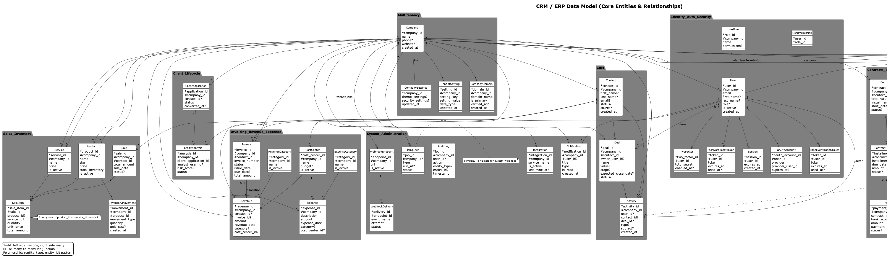

# Diagrams

Embed generated PNGs in Markdown using standard image syntax.

## From the repo root `README.md`

```md

```

## From this `diagrams/README.md`

```md

```

Tips:
- Keep image paths relative to the Markdown file location.
- For GitHub, `?raw=1` is not needed for images in the same repo.
- Prefer SVG for crisp zoom in docs: `./diagrams/CRM_ERP_FullModel.svg` (export as SVG).
- If your exporter names by source filename, use: `./diagrams/full_model.png`.
